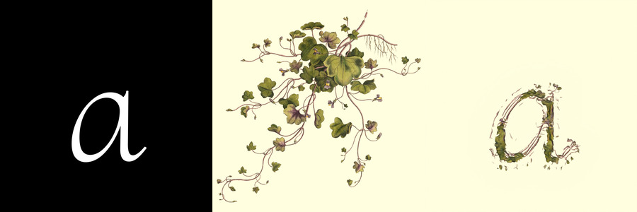

# Injertos Tipográficos

*Injertos Tipográficos* fue un laboratorio realizado en Bogotá durante mayo de 2022 gracias a la [*Beca Plataforma Bogotá en Arte, Ciencia y Tecnología*](https://plataformabogota.gov.co/).

El objetivo era crear un espacio de producción gráfica que utilizara tecnologías informáticas (redes neuronales) y se nutriera del intercambio de conocimiento entre la biología, la ecología, la taxonomía y la tipografía. Además, se buscó descubrir la diversidad y la importancia de las plantas que existen en la ciudad de Bogotá, así como resaltar la riqueza visual y conceptual de los glifos, los caracteres y los signos en general.

El resultado principal fue la creación de varios Injertos Tipográficos (la unión de una planta y una letra para crecer como un solo organismo) haciendo uso de la herramienta de inteligencia artificial [Shape-MatchingGAN](https://github.com/VITA-Group/ShapeMatchingGAN).

En este repositorio se encuentra:

- El cuaderno de Google Colab con el que se realizaron los injertos.
- Los modelos y datasets utilizados por los participantes del taller.

Se utilizó una [licencia MIT](https://choosealicense.com/licenses/mit/) para imponer muy pocas limitaciones en la reutilización del material y así contribuir a la cultura de la colaboración.

## Más información sobre el laboratorio:
- [Página web y galería](https://bejucoo.github.io/injertos/).
- [Instagram de Plataforma Bogotá](https://www.instagram.com/plataforma_bogota/).
---
[bejuco](https://bejuco.co/) @ 2022